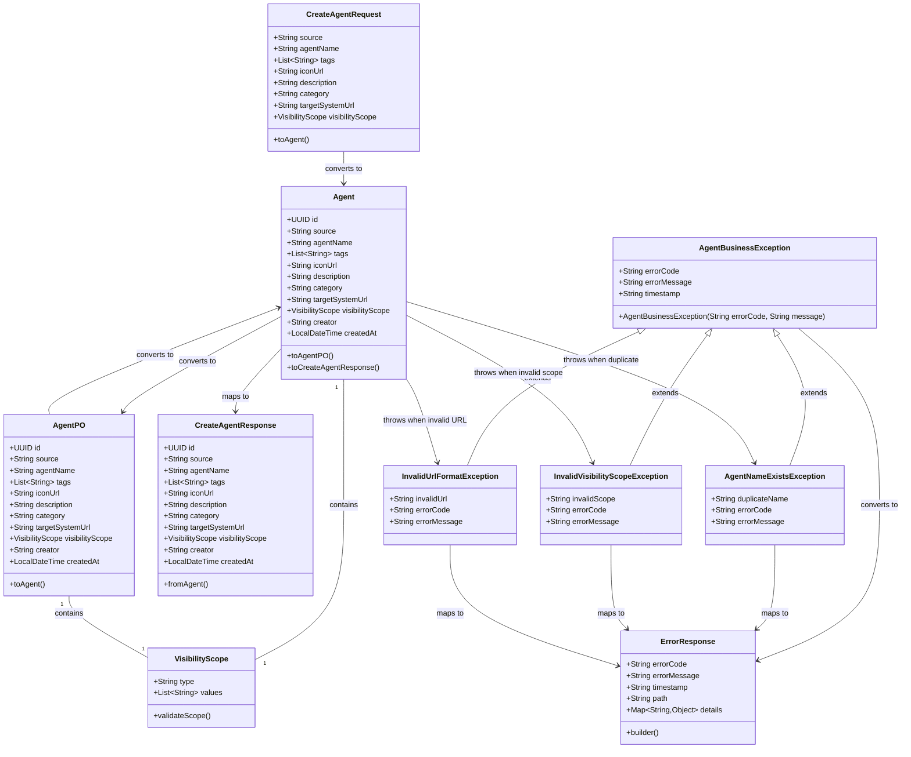

# Structured Prompt for Agent Creation API

## Requirements
Implement an enterprise-level intelligent service agent creation and management platform that supports standardized integration of multi-source intelligent services (FastGPT, manual configuration), access control, and metadata management to provide product teams with rapid deployment and centralized management capabilities.

## Business Model

## Solution
1. RESTful API Design:
   - Use POST /api/agents endpoint to implement Agent creation functionality
   - Follow HTTP status code standards (201 for successful creation, 400 for parameter errors, 409 for conflicts, 500 for server errors)
   - Use standard JSON format for data exchange
   - Implement unified error response format and exception handling mechanism

2. Layered Architecture Implementation:
   - Controller layer handles HTTP request processing and response formatting
   - Service layer implements core business logic, data validation, and business rules
   - Repository layer provides data persistence operations and query functionality
   - Use Spring Boot framework and Spring Data JPA for rapid development

3. Data Validation Strategy:
   - Use spring-boot-starter-validation for input parameter validation
   - Implement custom validators for business rule validation (name uniqueness, URL format, etc.)
   - Handle validation exceptions and business exceptions uniformly through GlobalExceptionHandler
   - Provide detailed error information and error codes for frontend processing

4. Business Logic Design:
   - Implement Agent name uniqueness checking mechanism
   - Support multiple visibility scope configurations (organization-level, personnel-level)
   - Automatically populate system fields such as creator and creation time

## Structure

### Inheritance Relationships
1. AgentService interface defines core business interfaces for Agent management
2. AgentServiceImpl implements AgentService interface
3. Agent extends BaseEntity class (contains common fields like id, creation time)
4. AgentController extends BaseController class (provides common response handling)
5. AgentBusinessException extends RuntimeException class (base business exception class)
6. AgentNameExistsException extends AgentBusinessException class (name duplication exception)
7. InvalidVisibilityScopeException extends AgentBusinessException class (invalid access scope exception)
8. InvalidUrlFormatException extends AgentBusinessException class (URL format error exception)

### Dependencies
1. AgentController depends on AgentService
2. AgentService depends on AgentRepository

### Layered Architecture
1. Controller Layer: HTTP request processing, parameter validation, response formatting
2. Service Layer: Business logic implementation, data validation, business rule execution
3. Repository Layer: Data persistence operations, query functionality
4. Data Access Layer: JPA entity mapping, database operations
5. Exception Handling Layer: Unified exception handling through GlobalExceptionHandler

## Tasks

### Create Business Model - Agent
1. Responsibilities: Define Agent business model and domain logic
2. Properties:
   - id: UUID - Primary key identifier
   - source: String - Source type (fastgpt or hand), validated using enum
   - agentName: String - Agent name, 50 character limit, required and unique
   - tags: List<String> - Tag list, optional, supports predefined options
   - iconUrl: String - Icon URL, optional, requires URL format validation
   - description: String - Description information, required, 500 character limit
   - category: String - Category, required, validates against predefined list
   - targetSystemUrl: String - Target system URL, required, requires URL format validation
   - visibilityScope: VisibilityScope - Visibility scope, required
   - creator: String - Creator, automatically populated by system
   - createdAt: LocalDateTime - Creation time, automatically populated by system
3. Methods:
   - toAgentPO(): AgentPO
     - Logic: Convert Agent business model to AgentPO persistence entity
     - Returns: AgentPO object for database operations
   - toCreateAgentResponse(): CreateAgentResponse
     - Logic: Convert Agent business model to CreateAgentResponse DTO
     - Returns: CreateAgentResponse object for API response
   - initializeSystemFields(String creator): void
     - Logic: Encapsulate initialization of system fields (creator, createdAt) within the domain object
     - Parameters: creator - the user/system creating the agent
4. Annotations:
   - @Data (Lombok for getters/setters)
   - @Builder (Lombok for builder pattern)
   - @AllArgsConstructor, @NoArgsConstructor (Lombok for constructors)

### Create Entity Class - AgentPO
1. Responsibilities: Provide Agent persistence entity for database operations
2. Properties:
   - id: UUID - Primary key identifier
   - source: String - Source type (fastgpt or hand)
   - agentName: String - Agent name
   - tags: List<String> - Tag list
   - iconUrl: String - Icon URL
   - description: String - Description information
   - category: String - Category
   - targetSystemUrl: String - Target system URL
   - visibilityScope: VisibilityScope - Visibility scope
   - creator: String - Creator, automatically populated by system
   - createdAt: LocalDateTime - Creation time, automatically populated by system
3. Methods:
   - toAgent(): Agent
     - Logic: Convert AgentPO persistence entity to Agent business model
     - Returns: Agent object for business operations
4. Annotations:
   - @Entity, @Table(name = "agents")
   - @Data (Lombok for getters/setters)
   - @Builder (Lombok for builder pattern)
   - @AllArgsConstructor, @NoArgsConstructor (Lombok for constructors)
   - @Id, @GeneratedValue(strategy = GenerationType.AUTO)
   - @Column(nullable = false, unique = true) for agentName

### Create Value Object - VisibilityScope
1. Responsibilities: Encapsulate visibility scope configuration information
2. Properties:
   - type: String - Scope type (organization or personnel)
   - values: List<String> - Specific list of organizations or personnel
3. Methods:
   - validateScope(): void
     - Logic: Validate if type is valid
     - Exception: Throw InvalidVisibilityScopeException if invalid

### Create Request DTO - CreateAgentRequest
1. Responsibilities: Encapsulate parameters for Agent creation requests
2. Properties:
   - source: String - Source type, required
   - agentName: String - Agent name, required with length limit
   - tags: List<String> - Tag list, optional
   - iconUrl: String - Icon URL, optional
   - description: String - Description, required with length limit
   - category: String - Category, required
   - targetSystemUrl: String - Target system URL, required
   - visibilityScope: VisibilityScope - Visibility scope, required
3. Methods:
   - toAgent(): Agent
     - Logic: Convert CreateAgentRequest to Agent business model
     - Returns: Agent object with mapped properties
4. Annotations:
   - @Data (Lombok for getters/setters)
   - @Builder (Lombok for builder pattern)
   - @AllArgsConstructor, @NoArgsConstructor (Lombok for constructors)
   - @NotNull, @NotBlank for required fields
   - @Size(max = 50) for agentName
   - @Size(max = 500) for description
   - @Pattern(regexp = "^https?://.*") for URLs
   - @Valid for nested objects

### Create Response DTO - CreateAgentResponse
1. Responsibilities: Encapsulate response data after successful Agent creation
2. Properties:
   - Contains all Agent field information
   - Includes system-generated id, creator, createdAt fields
3. Methods:
   - fromAgent(Agent agent): CreateAgentResponse
     - Logic: Convert Agent business model to response DTO
     - Returns: Complete response object
4. Annotations:
   - @Data (Lombok for getters/setters)
   - @Builder (Lombok for builder pattern)
   - @AllArgsConstructor, @NoArgsConstructor (Lombok for constructors)
   - @JsonFormat for date formatting
   - @JsonProperty for field mapping
     - Returns: Complete response object

### Implement Service Interface - AgentService
1. Interface definition:
   - createAgent(CreateAgentRequest request): CreateAgentResponse
2. Core method: createAgent(CreateAgentRequest request): CreateAgentResponse
   - Responsibilities: Define the contract for agent creation
   - Parameters: CreateAgentRequest - validated request containing agent data
   - Return value: CreateAgentResponse object containing complete Agent information

### Implement Service Implementation Class - AgentServiceImpl
1. Responsibilities: Implement specific business logic for AgentService interface
2. Method implementation:
   - Concrete implementation of createAgent method with all business logic and validation
   - Input validation:
     - Check Agent name uniqueness using repository
     - Validate visibility scope validity using domain object methods
   - Business logic:
     - Convert request to Agent domain model
     - Use Agent.initializeSystemFields() to set creator and createdAt
     - Convert Agent to AgentPO entity object
     - Call agentRepository to save the entity
     - Convert saved entity back to response object and return
   - Exception handling approach:
     - Only catch DataIntegrityViolationException to convert to AgentNameExistsException if needed
     - Rely on GlobalExceptionHandler for all other exception handling
     - Remove unnecessary try-catch blocks to simplify code
   - Private helper methods: validateAgentNameUniqueness,validateVisibilityScope
3. Annotations:
   - @Service
   - @Transactional
   - @RequiredArgsConstructor for dependency injection (constructor-based)

### Create Controller - AgentController
1. Responsibilities: Handle HTTP requests for Agent creation
2. Methods:
   - createAgent(@RequestBody @Valid CreateAgentRequest request): ResponseEntity<CreateAgentResponse>
     - Logic:
       - Receive and validate request parameters
       - Call AgentService to create Agent
       - Return HTTP 201 status code and creation result
     - Exception handling: Handled uniformly by GlobalExceptionHandler
3. Annotations:
   - @RestController
   - @RequestMapping("/api/agents")
   - @PostMapping
   - @Valid for request validation

### Create Data Access Layer - AgentRepository
1. Responsibilities: Provide data persistence operations for Agent
2. Methods:
   - existsByAgentName(String agentName): boolean
   - save(AgentPO agentPO): AgentPO
   - findById(UUID id): Optional<AgentPO>
3. Annotations:
   - @Repository
   - extends JpaRepository<AgentPO, UUID>

### Create Exception Handler - GlobalExceptionHandler
1. Responsibilities: Handle global exceptions uniformly, provide standardized error responses
2. Exception types:
   - AgentBusinessException: Business logic exceptions
   - MethodArgumentNotValidException: Spring validation exceptions
   - DataIntegrityViolationException: Data integrity exceptions
   - Exception: Unexpected system exceptions
3. Methods:
   - handleAgentBusinessException(AgentBusinessException): ResponseEntity<ErrorResponse>
   - handleMethodArgumentNotValidException(MethodArgumentNotValidException): ResponseEntity<ErrorResponse>
     - Logic: Transform Spring validation errors to business ErrorResponse format
     - Returns: HTTP 400 with detailed validation error information
   - handleDataIntegrityViolation(DataIntegrityViolationException): ResponseEntity<ErrorResponse>
   - handleGenericException(Exception): ResponseEntity<ErrorResponse>
4. Annotations:
   - @RestControllerAdvice
   - @ExceptionHandler for each exception type
5. Response format:
   - Unified ErrorResponse structure (errorCode, errorMessage, timestamp, path)

### Create Business Exception Class - AgentNameExistsException
1. Responsibilities: Handle business exception for duplicate Agent names
2. Inheritance relationship: extends AgentBusinessException
3. Properties:
   - errorCode: String - Error code (AGENT_NAME_EXISTS)
   - errorMessage: String - Error description
   - duplicateName: String - Duplicate Agent name
4. Constructors:
   - AgentNameExistsException(String duplicateName)
   - AgentNameExistsException(String duplicateName, Throwable cause)
5. Usage scenarios:
   - Thrown when Agent name uniqueness validation fails
   - Thrown when converting database constraint conflicts

### Create Business Exception Class - InvalidVisibilityScopeException
1. Responsibilities: Handle business exception for invalid visibility scope
2. Inheritance relationship: extends AgentBusinessException
3. Properties:
   - errorCode: String - Error code (INVALID_VISIBILITY_SCOPE)
   - errorMessage: String - Error description
   - invalidScope: String - Invalid scope value
4. Constructors:
   - InvalidVisibilityScopeException(String invalidScope)
   - InvalidVisibilityScopeException(String invalidScope, Throwable cause)
5. Usage scenarios:
   - Thrown when visibility scope validation fails
   - Thrown when organization or personnel does not exist

### Create Business Exception Class - InvalidUrlFormatException
1. Responsibilities: Handle business exception for URL format errors
2. Inheritance relationship: extends AgentBusinessException
3. Properties:
   - errorCode: String - Error code (INVALID_URL_FORMAT)
   - errorMessage: String - Error description
   - invalidUrl: String - Incorrectly formatted URL
4. Constructors:
   - InvalidUrlFormatException(String invalidUrl)
   - InvalidUrlFormatException(String invalidUrl, Throwable cause)
5. Usage scenarios:
   - Thrown when URL format validation fails
   - Thrown when iconUrl or targetSystemUrl format is incorrect

### Create Error Response DTO - ErrorResponse
1. Responsibilities: Unified error response format for API error information return
2. Properties:
   - errorCode: String - Business error code, such as AGENT_NAME_EXISTS, INVALID_URL_FORMAT, etc.
   - errorMessage: String - Detailed error description, user-friendly error information
   - timestamp: String - Error occurrence time, ISO 8601 format
   - path: String - Request path where the error occurred
   - details: Map<String, Object> - Additional error detail information (optional)
3. Methods:
   - builder(): ErrorResponseBuilder - Builder pattern to create ErrorResponse
   - of(String errorCode, String errorMessage): ErrorResponse - Static factory method
   - withPath(String path): ErrorResponse - Set request path
   - withDetails(Map<String, Object> details): ErrorResponse - Set detail information
4. Annotations:
   - @JsonFormat(pattern = "yyyy-MM-dd'T'HH:mm:ss.SSS'Z'") for timestamp
   - @JsonInclude(JsonInclude.Include.NON_NULL) for optional fields
5. Usage scenarios:
   - Unified format for all API error responses
   - Building error responses in GlobalExceptionHandler
   - Frontend can handle different errors based on errorCode

## Common Tasks
1. Annotation Standards:
   - Entity classes use @Entity, @Table, @Column and other JPA annotations
   - Controllers use @RestController, @RequestMapping, @PostMapping and other Spring MVC annotations
   - Service classes use @Service, @Transactional annotations
   - Data access layers use @Repository annotation
   - Validation uses @Valid, @NotNull, @Size, @Pattern and other spring-boot-starter-validation annotations

2. Dependency Injection:
   - Prefer constructor injection to ensure dependency immutability
   - Avoid circular dependencies

3. Exception Handling:
   - Handle exceptions uniformly through GlobalExceptionHandler
   - Business exception class inheritance hierarchy:
     * AgentBusinessException extends RuntimeException (base business exception class)
     * Specific exception classes extend AgentBusinessException
     * Must include errorCode and errorMessage
     * Categorized by business domain: data exceptions, validation exceptions, business rule exceptions
   - Unified error response format (ErrorResponse DTO)
   - Exception handler methods return ResponseEntity<ErrorResponse>
   - Log exceptions for problem tracking
   - Error code standards:
     * Use uppercase letters and underscores for naming (e.g.: AGENT_NAME_EXISTS)
     * Categorize by business domain prefixes (e.g.: AGENT_, VALIDATION_, SYSTEM_)
     * Error codes should be stable for frontend processing and documentation maintenance
     * Each error code should have corresponding user-friendly error messages

4. Data Validation:
   - Use Bean Validation for parameter validation
   - Custom validators handle complex business rules
   - Perform business logic validation at the Service layer
   - Domain objects should handle their own state initialization and validation
   - Set constraints at the database level to ensure data integrity

5. Logging:
   - Use SLF4J and Logback for logging
   - Log key business operations and exception information
   - Distinguish different log levels (DEBUG, INFO, WARN, ERROR)

## Constraints
1. Functional Constraints:
   - Only supports Agent creation functionality, does not include update, delete, query list and other operations
   - Supported source types are limited to fastgpt and hand
   - Tag options are pre-configured by backend, does not support dynamic management
   - Permission authentication is handled by gateway or upper-level middleware

2. Performance Constraints:
   - API response time does not exceed 2 seconds
   - Support concurrent creation requests of at least 100 per second
   - Database connection pool size reasonably configured
   - Use indexes to optimize query performance

3. Security Constraints:
   - Input parameters must have XSS protection
   - URL parameters need format validation
   - Sensitive information must not be logged
   - Use HTTPS protocol for data transmission

4. Integration Constraints:
   - Compatible with existing Spring Boot framework versions
   - Database uses JPA/Hibernate for ORM mapping
   - Follow RESTful API design standards
   - Support JSON format requests and responses

5. Business Rule Constraints:
   - Agent names must be globally unique
   - Description information must not contain sensitive words
   - Visibility scope must exist in the system
   - URLs must be valid HTTP/HTTPS addresses

6. Exception Handling Constraints:
   - Business exceptions must include clear error codes and error messages
   - Exception types must be categorized and named by business domain
   - Exception information must not expose sensitive internal system information
   - All business exceptions must be handled uniformly by GlobalExceptionHandler
   - Exception response format must be unified and include timestamp and request path

7. Technical Constraints:
   - Use Spring Boot 2.x or 3.x versions
   - Database supports MySQL 8.0 or PostgreSQL 12+
   - JDK version not lower than 11
   - Follow Alibaba Java development standards

8. API Constraints:
   - Use POST method to create resources
   - Successful creation returns HTTP 201 status code
   - Error cases return appropriate HTTP status codes (400, 409, 500, etc.)
   - Both requests and responses use JSON format
   - Content-Type must be application/json 